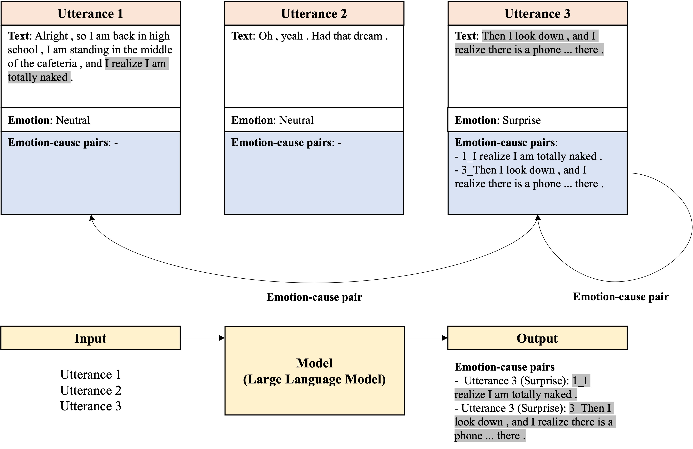
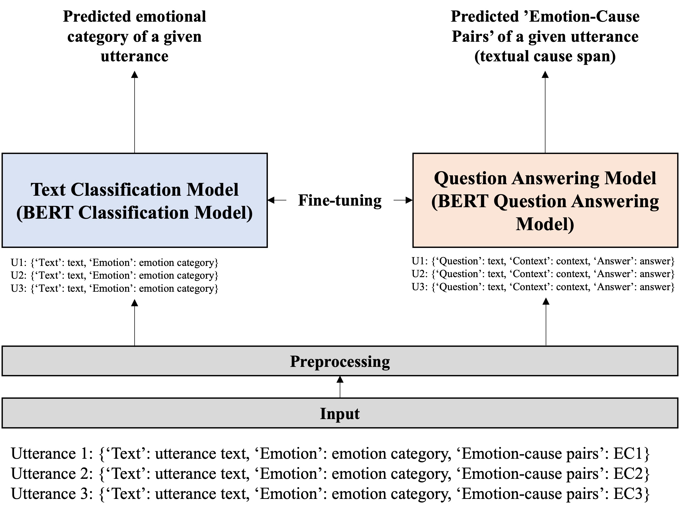
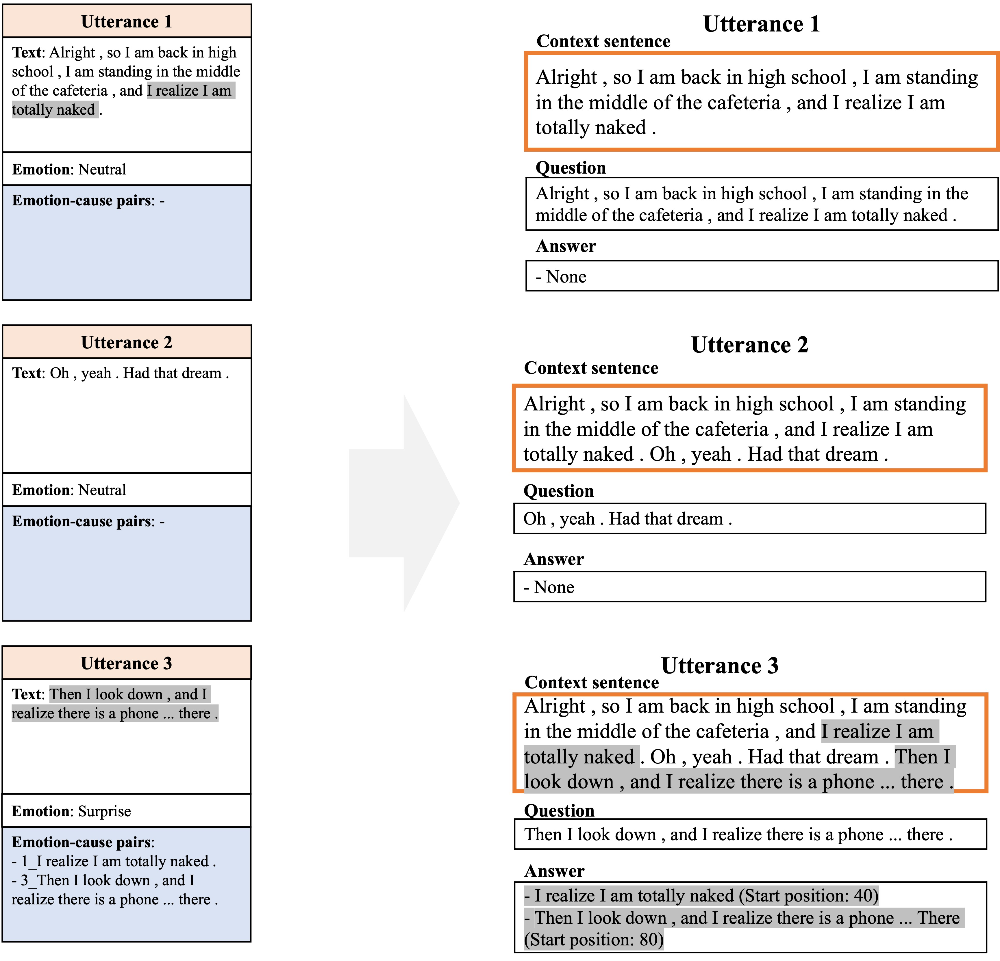

# Emotion-Cause-Pair-Extraction-with-BERT-FineTuning

## Background
- This project was the final project of Natural Language Processing course (CSCI 5832) at University of Colorado Boulder
- The main purpose of the final project was to solve a subset of one of SemEval-2024 Tasks.
- This project is in particular focusing on the subtask 1 of Task 3: The Competition of Multimodal Emotion Cause Analysis in Conversations.
- The project team members are:
    - Jooseok Lee
    - Seungwook Lee
- Simplified from the original project

## Introduction
- In this project, we aimed to solve the problem of textual Emotion-Cause Pair Extraction (ECPE), which is the first sub-task of SemEval-2024 Task 3,  using text classification and question answering framework.
- The main purpose of textual ECPE is to find all sets of emotion-cause pairs where each utterance (i.e., small subset of a conversation) is matched with a single or multiple textual cause span(s) along with its emotional category.

    

## Approach
- While the original paper solved this problem using a single solution, in this project we utilized two separate natural language processing (NLP) frameworks to solve it; text classification and question answering.
- That is, we splitted the original problem into two separate sub problems and solved them independently.
- In our approach, the text classification model is responsible for determining the emotional category of a given utterance.
- A single utterance is given to a classification model and it predicts the six emotional categories of the utterance (i.e., Anger, Disgust, Fear, Joy, Sadness and Surprise).
- We fine-tuned the publicly available text classification large language model (LLM) (i.e., BERT classification model) to solve this sub-problem.
- Then, we utilized a question answering model to find textual cause span(s) of a given utterance.
- In particular, we changed our data to Stanford Question Answering Dataset (SQuAD) format to fine-tune publicly available question answering LLM (i.e., DistilBERT question answering model).

    

## Text Classification
- In this assignment, we focus on one aspect of text classification: sentiment analysis.
- Sentiment analysis involves categorizing the emotional aspect of a given sentence or paragraph, identifying various emotional states such as positive, negative, or neutral.
- This type of analysis plays a crucial role in understanding the emotions and attitudes of users from various text sources like customer feedback, online reviews, and social media posts.
- Sentiment analysis has established itself as an important tool in understanding human emotions and attitudes through text data and is applied in various fields, including improving customer service, analyzing product reviews, public opinion research, and market analysis.

### Data Preprocessing
- For sentiment analysis, it is essential to first classify the sentences and the emotions (labels) felt in those sentences.
- Our data structure consists of conversations.
- Each conversation includes several utterances and the emotions felt in those utterances.
- The first step involves extracting the 'conversation' item from the JSON formatted data.
- Subsequently, each utterance within the conversation and its corresponding emotional label are classified.
- The classified emotional labels, which are a total of seven, are then converted into numbers for ease of model processing.
- Following this, the process of tokenization of the utterances is carried out.
- This step involves breaking down the text into smaller units known as tokens, which is crucial for transforming the text data into a format that can be processed by the model.
- For this task, we use the ALBERT model, hence, we employ the Hugging Face Transformer library for optimized tokenization.
- This library provides a tokenization method tailored to the ALBERT model, assisting the model in processing each utterance more accurately and effectively.

### Model Training
- In the process of model development, we adopted the fine-tuning approach using the pre-trained 'AlbertForSequenceClassification' model.
- This method involves adapting an existing model to suit specific datasets and requirements.
- A key change in the fine-tuning process was configuring the model to match the number of labels contained in our data. Since our dataset distinctly identifies seven emotional states, the model was set up to classify these seven categories.
- By utilizing the 'AlbertForSequenceClassification', we were able to leverage the advantages of the ALBERT model, known for its efficiency and effectiveness in language classification tasks.
- The ALBERT model employs the attention mechanism of the BERT model, which aids in understanding the nuanced use of words within sentences.
- This is particularly effective in environments with limited computing resources, as ALBERT can deliver similar performance.
- This is due to its smaller size, faster training speed, and lower memory usage.
- The fine-tuning process demonstrates the flexibility and adaptability of pre-trained models in natural language processing, proving to be highly efficient for specific applications like ours.

### Model Evaluation
- To evaluate the model, we split the data into two sets: train and validation set. 
- We also tested six different learning rates for the hyperparameter tuning purpose.
- For each learning rate, we trained the model for 10 epochs and validated if for each epoch to see the best number of epochs. 
- For the evaluation metrics, we used two metrics: Exact match and F1-score. 
- Exact match measures the proportion of the predicted textual cause spans that exactly match the true textual cause spans. 
- On the other hand, F1-score is the harmonic mean of recall and precision.

## Question Answering (SQuAD format)
- In this project, we viewed the sub-task of finding textual cause span(s) in ECPE as a question-answering problem.
- That is, we treated a given utterance as a question to be answered.
- The previous utterances including the given utterance itself can be viewed as a context where the answer (i.e., the textual cause span(s) of the given utterance) lies.
- We only consider that only previous utterances (including itself) can be regarded as possible emotional causes.

### Data Preprocessing
- In a single sample of original data, there are multiple utterances (i.e., utterance ID and the corresponding text), their emotions, and speakers.
- Also, the sample has ‘emotion-cause_pairs’ that the model should make a prediction on.
- The ‘emotion-cause_pairs’ is a set of emotion-cause pairs that matches the emotion of an utterance (e.g., ‘3_surprise’) and the corresponding causes (e.g., ‘1_I realize I am totally naked .’ and ‘3_Then I look down , and I realize there is a phone ... there .’).
- As mentioned before, we considered a given utterance with emotion as a question.
- Also, we treated previous utterances and the given utterance itself as a context where the corresponding answer (i.e., the textual cause span) could lie.

    

### Model Training
- After completing the proprocess, we fine-tuned a publicly available large language model (i.e., distilbert-base-cased-distilled-squad model) to solve the question-answering problem. 
- We selected this specific model because it is much smaller, cheaper, and faster than the BERT base model. 
- It uses 40% less parameters than the base model while preserving the 95% performance [https://huggingface.co/distilbert-base-cased-distilled-squad]. 
- The training loop is similar to the standard training process of other machine learning algorithms. 
- First, we feed the input to the large language model to calculate the losses for start and end logit of each token. 
- The losses of start and end logit are calculated with a standard binary cross entropy. 
- Once the loss is calculated, we apply the back propagation step to calculate the gradients for each parameter. AdamW optimizer was used in the back propagation step.
- In addition, a dynamic learning rate scheduler, which changes the learning rate during the process, was used to expedite the learning process. 

### Model Evaluation
- To evaluate the model, we split the data into two sets: train and validation set. 
- We also tested six different learning rates for the hyperparameter tuning purpose.
- For each learning rate, we trained the model for 10 epochs and validated if for each epoch to see the best number of epochs. 
- For the evaluation metrics, we used two metrics: Exact match and F1-score. 
- Exact match measures the proportion of the predicted textual cause spans that exactly match the true textual cause spans. 
- On the other hand, F1-score is the harmonic mean of recall and precision.